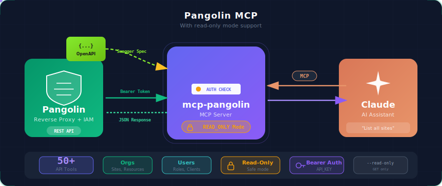

<h1 align="center">MCP Pangolin</h1>

<p align="center">
  <a href="LICENSE"></a>
  <a href="https://www.rust-lang.org/"></a>
</p>

<p align="center">
  <strong>A Model Context Protocol (MCP) server that exposes your Pangolin Integration API to Claude and other MCP-compatible AI assistants.</strong>
</p>

<p align="center">
  
</p>

---

## Overview

This project provides an MCP server that exposes all Pangolin API endpoints as tools, enabling AI assistants to manage your Pangolin infrastructure including organizations, sites, resources, roles, users, and more.

## Features

- Full coverage of Pangolin Integration API endpoints
- **Read-only mode** via `PANGOLIN_READ_ONLY` environment variable
- Bearer token authentication via `PANGOLIN_API_KEY`
- Automatic tool generation from OpenAPI/Swagger specification
- Support for path parameters, query parameters, and request bodies

---

## Sponsors

<table>
  <tr>
    <td align="center" width="200">
        <a href="https://getnatalia.com/">
        <br/>
        <b>Natalia</b>
        </a><br/>
        <sub>24/7 AI voice and whatsapp agent for customer services</sub>
    </td>
    <td align="center" width="200">
      <a href="https://nobullshitconseil.com/">
        <br/>
        <b>NoBullshitConseil</b>
      </a><br/>
      <sub>360° tech consulting</sub>
    </td>
    <td align="center" width="200">
      <a href="https://www.hook0.com/">
        <br/>
        <b>Hook0</b>
      </a><br/>
      <sub>Open-Source Webhooks-as-a-Service</sub>
    </td>
    <td align="center" width="200">
      <a href="https://france-nuage.fr/">
        <br/>
        <b>France-Nuage</b>
      </a><br/>
      <sub>Sovereign cloud hosting in France</sub>
    </td>
  </tr>
</table>

> **Interested in sponsoring?** [Get in touch](mailto:rust@fgribreau.com)

## Quick Start

### Prerequisites

- Rust stable ([install](https://rustup.rs/))
- A Pangolin instance with API access
- A Pangolin API key

### 1. Build the project

```bash
git clone https://github.com/FGRibreau/mcp-pangolin.git
cd mcp-pangolin
cargo build --release
```

### 2. Run the MCP server

```bash
./target/release/mcp-pangolin \
  --openapi pangolin-api.json \
  --api-key YOUR_API_KEY \
  --base-url https://your-pangolin-instance.com/v1
```

The server will:
1. Load the OpenAPI specification
2. Generate tool definitions for all endpoints
3. Start listening on stdin/stdout for MCP messages

### Read-Only Mode

To run the server in read-only mode (only GET operations are allowed):

```bash
./target/release/mcp-pangolin \
  --openapi pangolin-api.json \
  --api-key YOUR_API_KEY \
  --base-url https://your-pangolin-instance.com/v1 \
  --read-only
```

Or via environment variable:

```bash
export PANGOLIN_READ_ONLY=true
./target/release/mcp-pangolin \
  --openapi pangolin-api.json \
  --api-key YOUR_API_KEY \
  --base-url https://your-pangolin-instance.com/v1
```

## Configuration

### Environment Variables

| Variable | Description | Required |
|----------|-------------|----------|
| `PANGOLIN_API_KEY` | API key for Bearer token authentication | Yes |
| `PANGOLIN_BASE_URL` | Base URL for the Pangolin API | Yes |
| `PANGOLIN_OPENAPI_FILE` | Path to OpenAPI specification file | Yes* |
| `PANGOLIN_OPENAPI_JSON` | Inline OpenAPI specification JSON | Yes* |
| `PANGOLIN_READ_ONLY` | Set to `true` to enable read-only mode | No |

*Either `PANGOLIN_OPENAPI_FILE` or `PANGOLIN_OPENAPI_JSON` must be provided.

### Claude Code

Add the following to your Claude Code MCP settings:

```bash
claude mcp add pangolin \
  --command /path/to/mcp-pangolin \
  --args "--openapi" "/path/to/pangolin-api.json" "--base-url" "https://your-pangolin-instance.com/v1" \
  --env "PANGOLIN_API_KEY=YOUR_API_KEY"
```

For read-only mode:

```bash
claude mcp add pangolin \
  --command /path/to/mcp-pangolin \
  --args "--openapi" "/path/to/pangolin-api.json" "--base-url" "https://your-pangolin-instance.com/v1" "--read-only" \
  --env "PANGOLIN_API_KEY=YOUR_API_KEY"
```

Or manually add it to your MCP settings file:

```json
{
  "mcpServers": {
    "pangolin": {
      "command": "/path/to/mcp-pangolin",
      "args": [
        "--openapi", "/path/to/pangolin-api.json",
        "--base-url", "https://your-pangolin-instance.com/v1"
      ],
      "env": {
        "PANGOLIN_API_KEY": "YOUR_API_KEY",
        "PANGOLIN_READ_ONLY": "true"
      }
    }
  }
}
```

### Claude Desktop

Add to `~/Library/Application Support/Claude/claude_desktop_config.json` (macOS) or `%APPDATA%\Claude\claude_desktop_config.json` (Windows):

```json
{
  "mcpServers": {
    "pangolin": {
      "command": "/absolute/path/to/mcp-pangolin",
      "args": [
        "--openapi", "/absolute/path/to/pangolin-api.json",
        "--base-url", "https://your-pangolin-instance.com/v1"
      ],
      "env": {
        "PANGOLIN_API_KEY": "YOUR_API_KEY"
      }
    }
  }
}
```

## Usage Examples

Once configured, you can ask Claude questions like:

- *"List all organizations in Pangolin"*
- *"Show me the sites for organization 'my-org'"*
- *"What resources are available in site 123?"*
- *"List all users in the organization"*
- *"Show me the roles configured for this resource"*

And with write access (when not in read-only mode):

- *"Create a new site called 'production-us'"*
- *"Add user john@example.com to the admin role"*
- *"Update the resource configuration for the API gateway"*

## Available Tools

The MCP server generates tools based on the Pangolin OpenAPI specification. Below are the main categories:

### Organizations

| Tool | Description |
|------|-------------|
| `orgs` | List all organizations |
| `org_by_orgId` | Get an organization by ID |
| `create_org` | Create a new organization |
| `update_org_by_orgId` | Update an organization |
| `delete_org_by_orgId` | Delete an organization |

### Sites

| Tool | Description |
|------|-------------|
| `org_by_orgId_sites` | List all sites in an organization |
| `site_by_siteId` | Get a site by ID |
| `create_org_by_orgId_site` | Create a new site |
| `update_site_by_siteId` | Update a site |
| `delete_site_by_siteId` | Delete a site |

### Resources

| Tool | Description |
|------|-------------|
| `org_by_orgId_resources` | List resources for an organization |
| `resource_by_resourceId` | Get a resource by ID |
| `create_org_by_orgId_resource` | Create a resource |
| `update_resource_by_resourceId` | Update a resource |
| `delete_resource_by_resourceId` | Delete a resource |

### Site Resources

| Tool | Description |
|------|-------------|
| `org_by_orgId_site_resources` | List all site resources for an organization |
| `site_resource_by_siteResourceId` | Get a specific site resource |
| `create_org_by_orgId_site_resource` | Create a new site resource |
| `update_site_resource_by_siteResourceId` | Update a site resource |
| `delete_site_resource_by_siteResourceId` | Delete a site resource |

### Targets

| Tool | Description |
|------|-------------|
| `resource_by_resourceId_targets` | List targets for a resource |
| `target_by_targetId` | Get a target |
| `create_resource_by_resourceId_target` | Create a target |
| `update_target_by_targetId` | Update a target |
| `delete_target_by_targetId` | Delete a target |

### Users

| Tool | Description |
|------|-------------|
| `org_by_orgId_users` | List users in an organization |
| `org_by_orgId_user_by_userId` | Get a user in an organization |
| `create_org_by_orgId_user` | Create an organization user |
| `update_org_by_orgId_user_by_userId` | Update a user |
| `delete_org_by_orgId_user_by_userId` | Remove a user from an organization |

### Roles

| Tool | Description |
|------|-------------|
| `org_by_orgId_roles` | List roles in an organization |
| `role_by_roleId` | Get a role |
| `create_org_by_orgId_role` | Create a role |
| `delete_role_by_roleId` | Delete a role |

### Clients

| Tool | Description |
|------|-------------|
| `org_by_orgId_clients` | List all clients for an organization |
| `client_by_clientId` | Get a client by ID |
| `create_org_by_orgId_client` | Create a new client |
| `update_client_by_clientId` | Update a client |
| `delete_client_by_clientId` | Delete a client |

### Identity Providers

| Tool | Description |
|------|-------------|
| `idp` | List all identity providers |
| `idp_by_idpId` | Get an IDP by ID |
| `create_idp_oidc` | Create an OIDC IdP |
| `update_idp_by_idpId_oidc` | Update an OIDC IdP |
| `delete_idp_by_idpId` | Delete an IDP |

### API Keys

| Tool | Description |
|------|-------------|
| `org_by_orgId_api_keys` | List all API keys for an organization |
| `create_org_by_orgId_api_key` | Create a new API key |
| `delete_org_by_orgId_api_key_by_apiKeyId` | Delete an API key |

### Access Tokens

| Tool | Description |
|------|-------------|
| `org_by_orgId_access_tokens` | List all access tokens in an organization |
| `resource_by_resourceId_access_tokens` | List access tokens for a resource |
| `update_resource_by_resourceId_access_token` | Generate a new access token |
| `delete_access_token_by_accessTokenId` | Delete an access token |

### Domains

| Tool | Description |
|------|-------------|
| `org_by_orgId_domains` | List all domains for an organization |
| `org_by_orgId_domain_by_domainId` | Get a domain by ID |
| `org_by_orgId_domain_by_domainId_dns_records` | Get DNS records for a domain |

### Blueprints

| Tool | Description |
|------|-------------|
| `org_by_orgId_blueprints` | List all blueprints for an organization |
| `org_by_orgId_blueprint_by_blueprintId` | Get a blueprint by ID |
| `create_org_by_orgId_blueprint` | Apply a blueprint |

### Logs

| Tool | Description |
|------|-------------|
| `org_by_orgId_logs_request` | Query the request audit log |
| `org_by_orgId_logs_analytics` | Query request audit analytics |

## CLI Reference

```
mcp-pangolin [OPTIONS] --api-key <API_KEY> --base-url <BASE_URL>

Options:
  -o, --openapi <OPENAPI>        Path to OpenAPI/Swagger JSON specification file
                                 [env: PANGOLIN_OPENAPI_FILE]

      --openapi-json <JSON>      Inline OpenAPI/Swagger JSON specification
                                 [env: PANGOLIN_OPENAPI_JSON]

  -k, --api-key <API_KEY>        Pangolin API key for authentication
                                 [env: PANGOLIN_API_KEY]

  -b, --base-url <BASE_URL>      Base URL for the Pangolin API
                                 [env: PANGOLIN_BASE_URL]

  -r, --read-only                Enable read-only mode (only GET operations)
                                 [env: PANGOLIN_READ_ONLY]

  -h, --help                     Print help
  -V, --version                  Print version
```

## Development

```bash
# Build debug version
cargo build

# Run tests
cargo test

# Run with logging
RUST_LOG=debug ./target/debug/mcp-pangolin \
  --openapi pangolin-api.json \
  --api-key YOUR_KEY \
  --base-url https://api.example.com/v1
```

### Running Tests

```bash
# Run all tests
cargo test

# Run read-only mode tests specifically
cargo test --test read_only_mode

# Run tests with output
cargo test -- --nocapture
```

## Troubleshooting

### "No tools available"

1. Make sure your OpenAPI specification file is valid JSON
2. Check that the file path is correct
3. Try using absolute paths for the `--openapi` argument

### "401 Unauthorized" errors

1. Verify your API key is correct
2. Check that the API key has sufficient permissions
3. Ensure the API key is being passed correctly (via `--api-key` or `PANGOLIN_API_KEY` env var)

### "Connection refused" or timeouts

1. Verify your Pangolin instance is accessible
2. Check for firewalls or VPN requirements
3. Ensure the `--base-url` includes the correct protocol (https://) and API version path (/v1)

### Write operations blocked

If you're seeing "Write operation not allowed in read-only mode":

1. Check if `PANGOLIN_READ_ONLY` environment variable is set to `true`
2. Remove the `--read-only` flag if you need write access
3. Verify your API key has write permissions on the Pangolin instance

## Security Considerations

- **Read-Only Mode**: Use `PANGOLIN_READ_ONLY=true` in production environments where AI assistants should only have read access
- **API Key Security**: Never commit API keys to version control. Use environment variables or secret management solutions
- **Network Security**: Always use HTTPS for the base URL

## Contributing

Contributions are welcome! Please feel free to submit a Pull Request.

## License

MIT License - see [LICENSE](LICENSE) for details.

## Acknowledgments

- Built with [rmcp](https://github.com/anthropics/model-context-protocol) - Rust MCP SDK
- Inspired by the [Model Context Protocol](https://modelcontextprotocol.io/) specification
- Designed for [Pangolin](https://github.com/fosrl/pangolin) - Tunneled Reverse Proxy with Identity and Access Management
